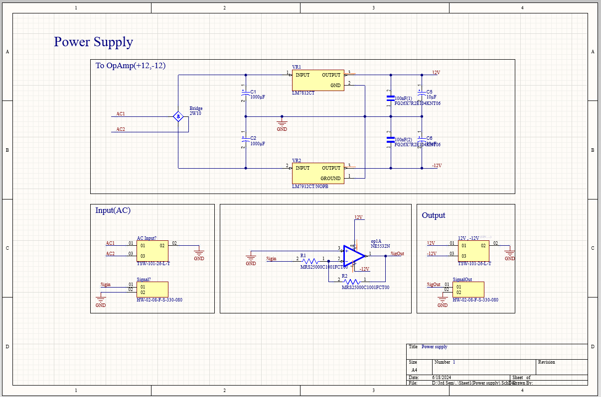
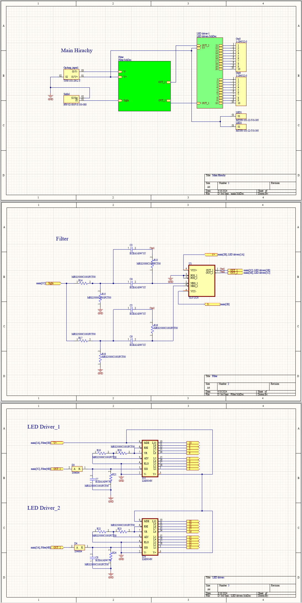
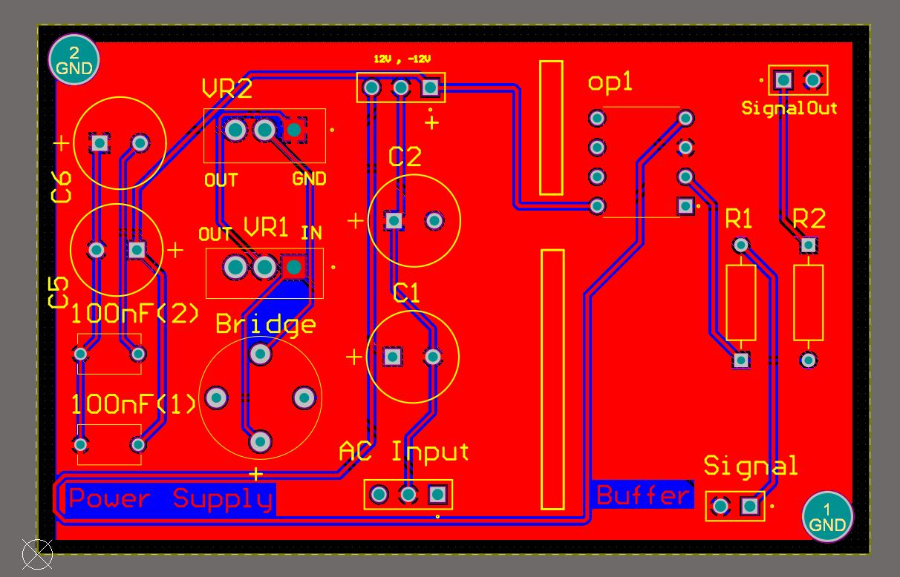
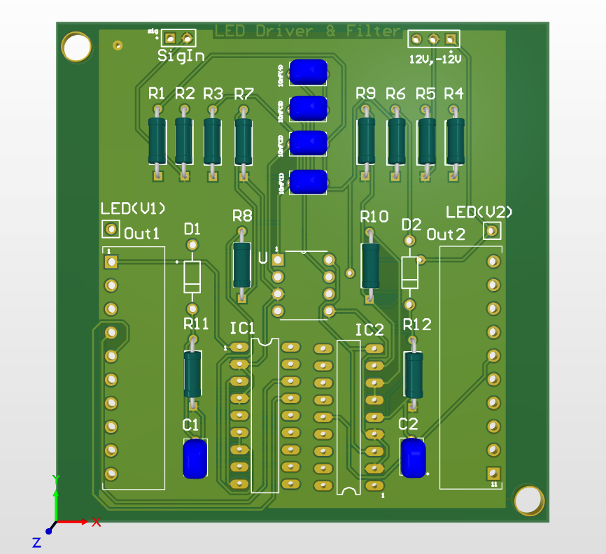

# Power Supply and Filter + LED Driver PCBs

This repository contains the schematics and PCB layouts for a power supply and a filter + LED driver circuit. These circuits are designed to provide a stable power supply and process input signals to drive LEDs.

## Table of Contents

1. [Overview](#overview)
2. [Schematics](#schematics)
3. [PCB Layouts](#pcb-layouts)
4. [Components](#components)
5. [Usage](#usage)

## Overview

This project consists of two main sections:
1. **Power Supply**: Converts AC input to regulated +12V and -12V DC outputs.
2. **Filter + LED Driver**: Filters the input signal and drives LEDs based on the processed signal.

### Power Supply
The power supply circuit includes:
- A bridge rectifier to convert AC to DC.
- Capacitors for filtering the DC signal.
- Voltage regulators (LM7812CT and LM7912CT) to provide +12V and -12V outputs.
- Decoupling capacitors to stabilize the output.

### Filter + LED Driver
The filter + LED driver circuit includes:
- An RC network for filtering the input signal.
- An operational amplifier (TL072CN) for signal amplification.
- Connections to an LED driver to control LED outputs based on the filtered signal.

## Schematics

### Power Supply Schematic

### Filter + LED Driver Schematic

## PCB Layouts

### Power Supply PCB

### Filter + LED Driver PCB

## Components

### Power Supply
- Bridge Rectifier: 2W10
- Capacitors: C1, C2 (1000 µF), C3, C4 (100 nF), C5, C6 (10 µF)
- Voltage Regulators: LM7812CT, LM7912CT/NOPB

### Filter + LED Driver
- Resistors: R14, R15, R16, R17, R18 (100Ω)
- Capacitors: C3, C4, C5, C6 (471 µF)
- Operational Amplifier: TL072CN
- Connectors: TSW-101-26-L-T, HW-02-08-F-S-330-080, MTSW-101-22-T-S-395

## Usage

1. **Power Supply**:
   - Connect AC inputs to AC1 and AC2 terminals.
   - The circuit will provide regulated +12V and -12V outputs.

2. **Filter + LED Driver**:
   - Connect the signal input to SigIn terminal.
   - The filtered and amplified signal will drive the LEDs connected to the LED driver outputs.

### Example Connections

- **Power Supply to Filter**:
  - V+ from the power supply to V+ of the filter.
  - V- from the power supply to V- of the filter.
  - Ground connections as needed.

- **Filter to LED Driver**:
  - OUT_1 and OUT_2 from the filter to the corresponding inputs of the LED driver.
